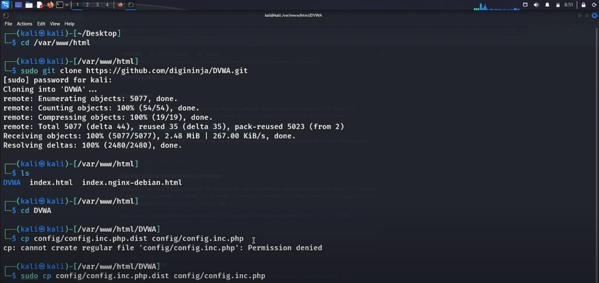

# vuln-scanner-project
This project was a part of my Master's degree in Cybersecurity. It focuses on vulnerability assessment using an open-source GitHub vulnerability scanner, which was modified and tested in a controlled lab environment.

## 🔧 Project Overview

The goal of this project was to:
- Customize and enhance an open-source vulnerability scanner
- Deploy a vulnerable web application on for testing
- Run scans to detect vulnerabilities and generate detailed reports
- Analyze risk severity and recommend mitigations

## 📸 Setup
the process of cloning the DVWA repository from GitHub into the /var/www/html directory using git clone. After the cloning, I navigated into the DVWA directory and attempted to copy the configuration file using sudo

