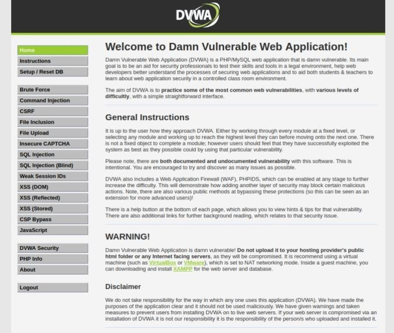

# vuln-scanner-project
This project was a part of my Master's degree in Cybersecurity. It focuses on vulnerability assessment using an open-source GitHub vulnerability scanner, which was modified and tested in a controlled lab environment.

## 🔧 Project Overview

The goal of this project was to:
- Customize and enhance an open-source vulnerability scanner
- Deploy a vulnerable web application on for testing
- Run scans to detect vulnerabilities and generate detailed reports
- Analyze risk severity and recommend mitigations

## 📸 Setup
the process of cloning the DVWA repository from GitHub into the /var/www/html directory using git clone. After the cloning, I navigated into the DVWA directory and attempted to copy the configuration file using sudo

I viewed the contents of the config.inc.php file using cat. The file contains configuration variables for connecting DVWA to MariaDB) database, including server,database name,username, and password.

Here, the MariaDB service is started using sudo service mariadb start. This is an essential step to ensure the web application can communicate with the database

the apache2 web server is started This is an essential step to ensure the web app is running

The MariaDB CLI was accessed with root privileges. I created the DVWA database with the appropriate privileges and access credentials defined in the earlier config file.

the web app is ready to be tested

we can see the command to run the tool named as securetask.py written in Python, the following IP address is the one of the vulnerable website

This is the first screen what the user will get after running the tool, it shows the name, the available and unavailable tools

Inside The tool running, this is feedback while it runs, basically it will show Threat level, Definition, Remediation

Finally, here you’ll get feedback or rather a brief report on what are the findings and how many vulnerabilities were being checked and skipped also detected.

